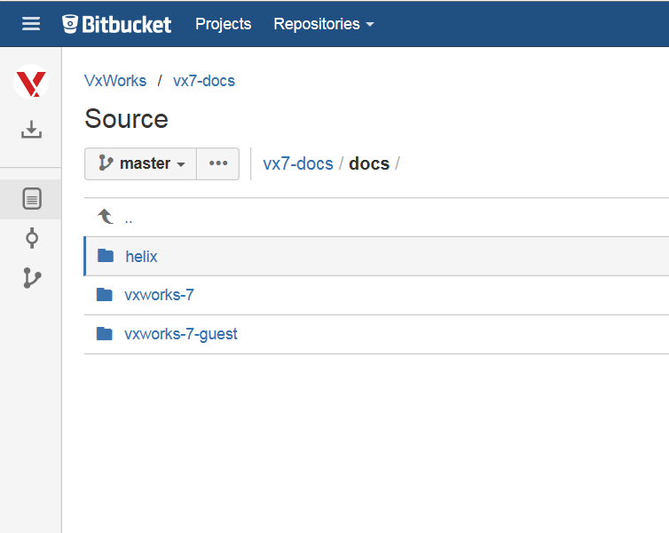
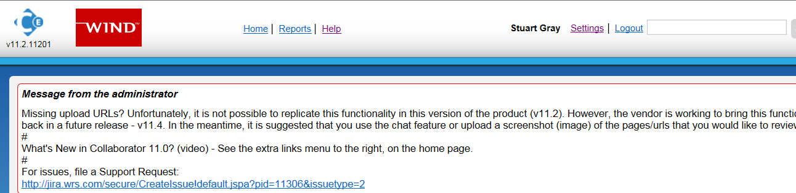
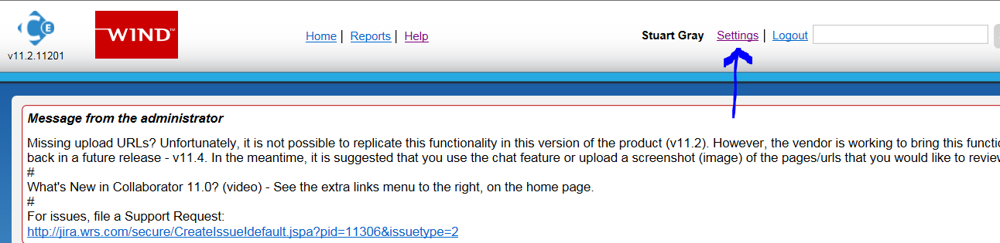

:orphan:
|
|
|

=========================================== 
BSP Documentation Update Guideline
===========================================

|

**Context**
-----------

The legacy target.nr has been retired in favour of a new BSP documentation approach. This provides the guidelines for updating xxx_readme.md and BSP Supplement.

For a description of why and what the process entails, refer to `Retiring target.ref and Replacing with xxx_readme.md + BSP Supplement <./RetiringTarget_ReplacingWithReadmefile_BSPSupplement.html>`__

**Prerequisites**
-----------------

These steps assume the following:

1. *Stash Contents and xxx_readme.md Files*

The vx7-integration git repository contains product files.

The xxx_readme.md files are located in the BSP directory, found at vxworks/helix/guests/vxworks-7/pkgs_v2/os/board.

|image0|

2. *Product Documentation Stash Repo*

BSP Supplement documents that are installed with VxWorks are committed to the InfoDev stash webpage.

|image1|

3. *The WR Support Network site contains BSP Supplement documents.*

One BSP Supplement exists per Wind River supplied BSP.

|image2|

The BSP Supplements are also accessible from the git repository.

http://opengrok.wrs.com/source/xref/vx7-integration/docs/docs/vxworks-7/Processor_and_Device%20Support/

|image3|

4. *Engineering are documenting updates to BSP features / defects.*

These steps assume that WR Engineering must update the customer facing BSP documents to communicate BSP features / defects changes to customers.

     
- It is likely that WR Engineering will need to update the BSP Supplement.
- It is possible WR Engineering may need to update the xxx_readme.md BSP file(s).

 
5. *Both WR Engineering and InfoDev groups are involved in maintaining the customer facing BSP documents.*

6. *Unsupported BSPs do not have InfoDev produced documentation, but will contain a WR Engineering produced documentation file.*

7. *InfoDev and WR Engineering use the Code Review tool to approve proposed BSP document updates*

   - The InfoDev representative who is responsible for the maintenance of the xxx_readme.md files must setup a file subscription in CodeReview.

   - This is important because it automatically adds the InfoDev representative to all Code Review reviews that involve changes to the xxx_readme.md BSP files.

   - Setup the Code Review file subscription as follows:

     - Login to Code Review

|image4|
   
	 - Select Settings
   
|image5|
	 
	 - Select the tab File Subscriptions 
	 
|image6|
 
	 - Enter the File Pattern as *os/board/*/*/*.md*

|image7|
	 
	 - Ensure the role selected is Reviewer

	 - Select Create New

|image8|

**Context**
-----------

     
1. Updates affecting the list of supported device drivers, components and the basic target boot process must be made to xxx_readme.md file(s) in the BSP directory. This file is brief and must not be expanded beyond its current structure without agreement with InfoDev and VxWorks PM.
     
2. Updates affecting all other aspects of the BSP must be documented in the relevant BSP Supplement document, not the xxx_readme.md file. The BSP Supplement is found on the Wind River Support Network site and git repo (see prerequisites above).

 
**Steps for Updating Customer Visible BSP Documentation**
----------------------------------------------------------

1. WR Engineering must locate the appropriate customer facing document to be updated. Locate the most recent edition of the document to be updated in the following locations:

   **BSP Supplements:**

   - http://opengrok.wrs.com/source/xref/vx7-integration/docs/docs/vxworks-7/Processor_and_Device%20Support/

   - If the BSP Supplement is not located in the directory above, then the most recent edition of the document will be located by following "path" on the Wind River Support Network:

     - VxWorks SR0XXX -> Documentation -> Processor & Device Support -> General BSP -> BSP Reference

     - NOTE: the "SR0XXX" above refers to the most recent SR release of VxWorks.

   **xxx_readme.md:**

   - Locate this in the BSP directory. For example, if the updates are to be made to a fsl_imx6 BSP readme file, look here:

   - http://opengrok.wrs.com/source/xref/vx7-integration/helix/guests/vxworks-7/pkgs_v2/os/board/freescale/fsl_imx6/

2. If the customer facing document to be updated is the BSP Supplement, WR Engineering must mark up a PDF. If the document to be updated is xxx_readme.md, it is okay to mark up the markdown file directly. The updates must clearly state:

   - the location WHERE the updates must be made.   

   - a complete written description of the updates to the text.
     

3. WR Engineering commits the updated customer facing documents as follows:

   - BSP Supplement PDF committed in the git repo to:

   - http://opengrok.wrs.com/source/xref/vx7-SR0610-features/docs/docs/vxworks-7/Processor_and_Device%20Support/http://opengrok.wrs.com/source/xref/vx7-integration/docs/docs/vxworks-7/Processor_and_Device%20Support/.   

   - Updated xxx_readme.md files must be committed to the BSP directory in the git repo to:  http://opengrok.wrs.com/source/xref/vx7-integration/helix/guests/vxworks-7/pkgs_v2/os/board/freescale/fsl_imx6/.

     

4. WR Engineering raises a JIRA defect, assigns it to InfoDev documentation group and links to the marked up file (s). This step triggers InfoDev.

     

5. InfoDev group responds to the JIRA defect containing the marked up PDF and makes necessary updates to the Dita BSP Supplement document and/or xxx_readme.md.

     

6. InfoDev creates a codereview with engineering to review changes to xxx_readme.md file(s) and/or updated BSP Supplement PDF. Review cycle proceeds between WR Engineering and Info Dev.

     

7. On completion of the review, either InfoDev or engineering will update the reviewed xxx_readme.md in the git repo.

 

8. At GA time, publish the BSP Supplement:
   
   - InfoDev will update the reviewed BSP Supplement Guide on WR Support Network.

   - InfoDev will update the BSP Supplement Guide in the InfoDev documentation git repo:

     http://tpgit.wrs.com:7990/projects/VX7/repos/vx7-docs/browse/docs

 
*Note*: There is no customer facing documentation for unsupported BSPs. InfoDev do no work on unsupported BSP documentation.

		 
|

**Change Log**
--------------
+----------------+----------------+----------------+----------------+---------------------------------------+
| **Date**       | **Change       | **Version**    | **Change By**  | **Description**                       |
|                | Request ID**   |                |                |                                       |
+----------------+----------------+----------------+----------------+---------------------------------------+
| 06/24/2020     | N/A            | 0.1            | Shree Vidya    | Transferred content from VxWorks BSP  |
|                |                |                | Jayaraman      | Documentation Update Jive page        |
+----------------+----------------+----------------+----------------+---------------------------------------+
|                |                |                |                |                                       |
+----------------+----------------+----------------+----------------+---------------------------------------+

.. |image3| image:: ../../../_static/CoreDev/CodingIntBuild/BSPDocumn_Image3.jpg

