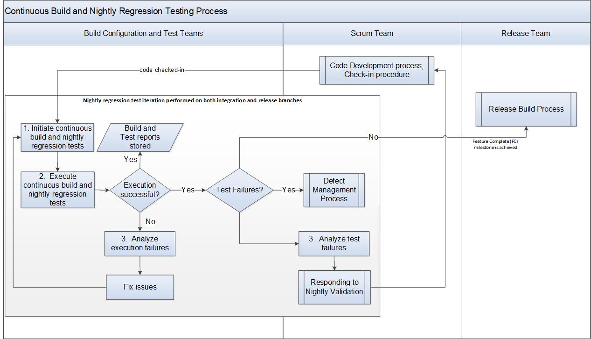

:orphan:

|
|
|

========================================================
Continuous Build and Nightly Regression Testing Process
========================================================

|

A series of tests and configuration builds are run on nightly basis to identify any regression issues from daily check-ins.  The activities mentioned below are automated/scheduled tasks executed by the Build system (e.g., Jenkins). 

The Architect/Domain Leads are responsible to identify the configurations and test matrices for the nightly regression and the test team is responsible for nightly regression test runs.

|

+--------------------------------------+--------------------------------------+
| **Entry Criteria**                   | - Code checked in and ready for      |
|                                      |   nightly regression testing         |
+--------------------------------------+--------------------------------------+
| **Inputs**                           | - Integration branch                 |
|                                      | - Build configurations and test      |
|                                      |   matrices                           |
+--------------------------------------+--------------------------------------+
| **Exit Criteria**                    | - Nightly regression tests completed |
+--------------------------------------+--------------------------------------+
| **Outputs**                          | - Test results stored in the Test    |
|                                      |   Management system (LTAF)           |
|                                      | - Issues logged in the Defect        |     
|                                      |   Management system (Jira)           |
|                                      | - Email notification sent to         |
|                                      |   Engineering team                   |
+--------------------------------------+--------------------------------------+

|

**Activities**
--------------

|image0| 

.. list-table::
   :widths: 10 30 120
   :header-rows: 1   
   
   * - Step #
     - Activity Name
     - Description
    
   * - 1
     - Initiate the continuous build and nightly regression tests
     - Continuous build and nightly regression tests are scheduled on a nightly basis via the Build system on the integration and release branches.
	  
   * - 2
     - Execute Build and Tests
     - The continuouse build and nightly regression test iterations are performed until the Feature Complete (FC) milestone is achieved.  After the Feature Complete milestone is achieved, the `Release Build process <./ReleaseBuildProcess.html>`__ is initiated.
	 
       - If the execution of build and tests are successful, then the build and test reports are stored and email notification is sent to Engineering team.
	   - If the nightly regression tests fail with errors, the defects are filed as specified by the `Defect Management Process <../../Operations/DefectManagement/DefectManagementProcess.html>`__ in the domain area that shows failures and the report is sent to the Domain Leads to review and analyze.	
   
       Note: In parallel, the `Feature/Epic verification (Testing) Process <../Verification/Feature_EpicVerification_TestingProcess.html>`__ is performed.  

   * - 3
     - Analyze execution and test failures  
     - For failures, the engineering team determine if the failures are due to simple infrastructure issues (e.g. disk full, configuration typo) or product defect. The engineering team responds according to the `Responding to Nightly Validation Procedure <../../../SupplementaryGuidelines/Development/RespondingToNightlyValidation_SG.html>`_  
	 
       For infrastructure issues, take steps to address the issue directly.	   

|

**Related Process Assets/Tools**
---------------------------------

- `Release Build process <./ReleaseBuildProcess.html>`__ 
- `Responding to Nightly Validation <../../../SupplementaryGuidelines/Development/RespondingToNightlyValidation_SG.html>`_
- `How to Handle Build Issues <../../../ProcessDocuments/CoreDev/CodingIntBuild/HowToHandleBuildIssues_Final.docx>`__
- `Build Warning Guidelines of VxWorks 7 <../../../SupplementaryGuidelines/Development/GuidelinesBuildWarning_SG.html>`__
- `Feature/Epic verification (Testing) Process <../Verification/Feature_EpicVerification_TestingProcess.html>`__
- Engineering Requirements Management system (e.g., Jira Agile)
- Configuration Management system (e.g., Git)
- CI pipline build system (e.g., Jenkins)

   
|

**References**
-----------------
- ?

|

**Change Log**
--------------

+--------------+------------------------+---------------+-------------------------+-------------------------------------------------------------------------------------+
| **Date**     | **Change Request ID**  | **Version**   | **Change By**           | **Description**                                                                     |
+--------------+------------------------+---------------+-------------------------+-------------------------------------------------------------------------------------+
| 05/01/2020   | N/A                    | 0.1           | Shree Vidya Jayaraman   | Initial Draft                                                                       |
+--------------+------------------------+---------------+-------------------------+-------------------------------------------------------------------------------------+
| 06/26/2020   | N/A                    | 0.2           | Shree Vidya Jayaraman   | Updates based on Kitty's feedback                                                   |
+--------------+------------------------+---------------+-------------------------+-------------------------------------------------------------------------------------+
| 07/22/2020   | N/A                    | 0.3           | Shree Vidya Jayaraman   | Updates based on Kitty's feedback (remove nightly regression test details)          |
+--------------+------------------------+---------------+-------------------------+-------------------------------------------------------------------------------------+
| 07/24/2020   | N/A                    | 0.4           | Shree Vidya Jayaraman   | Updates based on Kitty's feedback                                                   |
+--------------+------------------------+---------------+-------------------------+-------------------------------------------------------------------------------------+
|              |                        |               |                         |                                                                                     |
+--------------+------------------------+---------------+-------------------------+-------------------------------------------------------------------------------------+
|              |                        |               |                         |                                                                                     |
+--------------+------------------------+---------------+-------------------------+-------------------------------------------------------------------------------------+

