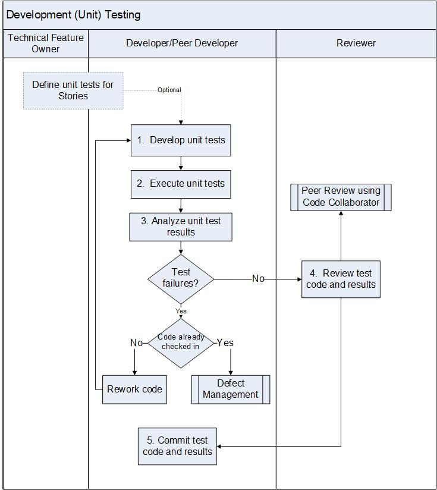

:orphan:

|
|
|

======================================
Development (Unit) Testing Procedure
======================================

|

This procedure ensures that unit tests are conducted/performed by the Developer to verify individual code changes.  Some code changes may not include unit tests, but will rely on regression tests to verify the change is appropriate. Unit tests are tests performed on a unit of change by the Developer before the code review.  

Note:  The Unit tests may be performed by a peer developer in parallel to the implementation activities.

The Developer is responsible for this process.  

|

+--------------------------------------+---------------------------------------------------------------------------+
| **Entry Criteria**                   | - Implementation Story created with implementation and unit test Tasks    |
|                                      | - Code change completed, but not necessarily reviewed                     |
|                                      | - Code change is clean from build warning and static analysis issues      |
|                                      | - Code change to fix defect                                               |
+--------------------------------------+---------------------------------------------------------------------------+
| **Inputs**                           | - Developer code change is available for unit testing                     |
+--------------------------------------+---------------------------------------------------------------------------+
| **Exit Criteria**                    | - Execution of unit tests, and issues fixed                               |
|                                      | - Results of the unit tests are captured and available for code review    |
|                                      | - Unit tests passed, and clean from Compiler and Static code analysis     |
+--------------------------------------+---------------------------------------------------------------------------+
| **Outputs**                          | - Code and unit test results are ready for peer review                    |
|                                      | - Peer reviewed code committed to the CM system (e.g., Git repo)          |
|                                      | - Approved tests and results stored in the Test Management system         |
|                                      |   (e.g., LTAF)                                                            |
+--------------------------------------+---------------------------------------------------------------------------+

|

**Activities**
--------------

|image0|

.. list-table::
   :widths: 10 30 120
   :header-rows: 1   
   
   * - Step #
     - Activity Name
     - Description
      
   * - 1
     - Develop unit tests based on the completion of development.
     - The Scrum Team ensures the implementation Story has been created with Development and Unit Test Tasks.  The Developer writes new unit test code according to the Coding Standards unless the unit test code is ported from open source.  The Developer writes test code that can be incorporated into the nightly or release testing or updates the existing test code for the initiating a Story or defect.  
	 
       For complex Stories, the Technical Feature Owner or the Developer may define specific unit testing required as part of the Story defintion. 
  	 
       The Scrum Team creates the Feature/Epic Test Plan and the features/epics are tested as part of the Development unit testing. See `Creating Feature Test Plan Guideline <../Verification/CreatingFTPGudieline.html>`__ (*NL 8/12: this file doesn't exist?*).    If needed, the test team can use the Feature/Epic Test plan as an input for feature/epic verification test creation.

   * - 2
     - Execute unit tests
     - The Developer/Peer Developer executes the unit tests on run time target using real hardware or a system simulator tool e.g., Simics. 

   * - 3
     - Analyze unit test results
     - The Developer analyzes the unit test results. 
	   
       If code has not been checked in, then the Developer reworks the code before submission.

       If code has been checked in, then a defect is filed against the code. 

       If the unit test identifies defects, a defect is entered in the Defect Management system.

   * - 4
     - Review test code and results
     - The Reviewer reviews the test code and results as part of the development code review (peer review of code) or seperately using the peer review system (e.g., code collaborator).  See  `Peer Review Procedure Using Code Collaborator Tool <./PeerReviewProcedure_CodeCollaborator.html>`__.  
	      
   * - 5
     - Commit test code and results
     - once the code review has been completed/approved by the reviewer, the developer commits the code in to the CM system ( e.g., Git repository) by following the `Check-in procedure <./CheckinProcedure.html>`__ and the test results in the Test Management system (e.g., LTAF).   The Developer contacts the test team to integrate tests into nightly or release test maxtrix for future regression testing. If needed, the Tester may use the unit tests as an input for verification test creation.
	 
|

**Related Process Assets/Tools**
--------------------------------

- Engineering Requirements Management system (e.g., Jira Agile)
- Configuration Management system (e.g., Git)
- CI Launcher (e.g., Jenkins)
   
|

**References**
-----------------

- Refer to `Supplementary Guidelines <../../../SupplementaryGuidelines/SupplementaryGuidelinesIndex.html#development>`_ section.
   
|

**Change Log**
--------------

+--------------+------------------------+---------------+-------------------------+-------------------------------------------------------------------------------------+
| **Date**     | **Change Request ID**  | **Version**   | **Change By**           | **Description**                                                                     |
+--------------+------------------------+---------------+-------------------------+-------------------------------------------------------------------------------------+
| 05/01/2020   | N/A                    | 0.1           | Shree Vidya Jayaraman   | Initial Draft                                                                       |
+--------------+------------------------+---------------+-------------------------+-------------------------------------------------------------------------------------+
| 06/22/2020   | N/A                    | 0.2           | Shree Vidya Jayaraman   | Change process to procedure                                                         |
+--------------+------------------------+---------------+-------------------------+-------------------------------------------------------------------------------------+
| 06/29/2020   | N/A                    | 0.3           | Shree Vidya Jayaraman   | Updates to step 1 based on Kitty's feedback                                         |
+--------------+------------------------+---------------+-------------------------+-------------------------------------------------------------------------------------+
| 07/01/2020   | N/A                    | 0.4           | Shree Vidya Jayaraman   | Updates based on Kitty's feedback                                                   |
+--------------+------------------------+---------------+-------------------------+-------------------------------------------------------------------------------------+
|              |                        |               |                         |                                                                                     |
+--------------+------------------------+---------------+-------------------------+-------------------------------------------------------------------------------------+
|              |                        |               |                         |                                                                                     |
+--------------+------------------------+---------------+-------------------------+-------------------------------------------------------------------------------------+

