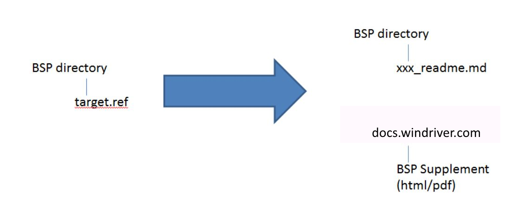
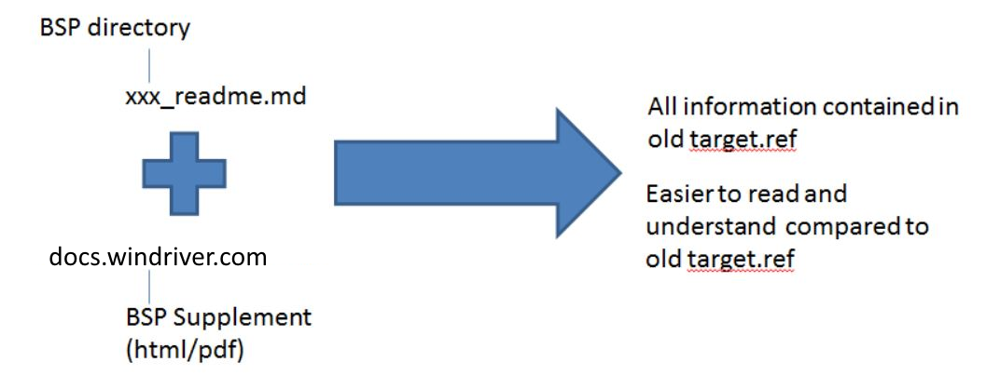

:orphan:
|
|
|

======================================================================== 
Retiring Target.ref and Replacing with XXX_readme.md + BSPSupplement
========================================================================

|

**Background**
----------------

For over 30 years, VxWorks Board Support Packages (BSP) have included a text file, located in the BSP directory, that presents information useful to anyone using this BSP. It describes hardware specific issues like driver configuration options, approaches to solving problems with the target and gives guidance to boot and run VxWorks on the particular supported target board. This BSP text file has become known as target.ref.

Every BSP target.ref file contains ESSENTIAL information. This file is highly valued by customers and WR technical staff (e.g. FAEs on site with customers) and viewed by all as the REAL gold dust information for VxWorks on this particular target board.

The authorship of target.ref is highly specialized - typically the developer who wrote the BSP, the QA testing engineer who verifies the BSP, and the field engineer who applies it in the field will contribute to it.

The formatting commands in target.ref are NROFF/TROFF which is a legacy technology.

|

**Current Problems With target.ref**
------------------------------------------

As embedded hardware has evolved, and VxWorks BSPs and drivers have advanced, the complexity of the target.ref file has grown and many of these text files have become extremely long and complicated. Whereas in the past a BSP was usually written to support a single VME board (for example) with minimal configuration options, today VxWorks 7 contains generic BSPs that apply to a wide range of target boards. The BSPs itl_generic and fsl_imx6 are examples of generic BSPs. This has led to some problems:

1. This evolution in the embedded landscape has resulted in very long and complex BSP target.ref files. The itl_generic target.ref file is over 20,000 words in length. It contains detailed instructions for booting different boards in various different ways, while enabling and disabling different options.
2. The target.ref also tends to stray from vital board hardware specific details to also include redundant information. One often finds descriptions of bootloaders, VSB's, etc. and how to use them in target.ref. Yet there are already documents in the WR Support Network website that do this job.
3. Because the file is written in text, it is hard to maintain by WR and so as the BSP changes over time, the information in target.ref becomes out of date.
4. It is also hard to render the text document in an easily readable way. This makes it hard for customers to understand the different workflows presented within the file.
5. The potential confusion caused by the current format of target.ref exposes WR to customer dissatisfaction issues...leading to TSRs, expensive FAE site visits, etc.

We will continue to protect and value the information contained within BSP target.ref files, and all future VxWorks BSPs must contain this sort of information. However - we must solve the problems associated with the presentation of this information in the legacy target.ref file. 

|

**Solution**
-------------

The solution is to protect the information within target.ref and present it in a more user friendly way. We are doing this in the following way:

|image0|

**xxx_readme.md**
~~~~~~~~~~~~~~~~~

This is a hardware board specific text file formatted in markdown for enhanced readability. 

The job of xxx_readme.md is to give a single, proven method for booting this particular hardware target board into VxWorks using this BSP. When the user follows these instructions - they will always succeed in achieving a VxWorks banner on the target board console.

Note:

- The file name describes the particular board being described and is of the following format:

  <target board name>_readme.md

  For example:

cherry_hill_readme.md

xlnx_zcu102_readme.md

  It should be obvious from the file name which hardware target board boot process is documented in this readme.file.

- This file is SHORT and SIMPLE. For example:

  itl_generic target.ref file - 20,000 words long

  itl_generic_readme.md - 1,050 words long

- Each xxx_readme.md file should only use markdown formatting commands.
- Each xxx_readme.md file should contain a functional link to the relevant BSP Supplement document in the WR Support Network website.
- There will be one xxx_readme.md per supported board. So, for BSPs that support multiple target boards, those BSPs will contain multiple xxx_readme.md files. Each document describes the boot process for that board. For example:

  fsl_imx6 BSP supports 5 particular hardware target boards, so the BSP contains 5 separate xxx_readme.md files.

imx6dl_sabre_ai_readme.md

imx6q_sabre_lite_readme.md

imx6q_sabre_sd_readme.md

imx6qp_sabre_sd_readme.md

imx6sx_sabre_sd_readme.md
   

**BSP_Supplement**
~~~~~~~~~~~~~~~~~~~

There will be one BSP supplement document per BSP. The function of this document is to contain all the target.ref information that has been omitted by the BSP xxx_readme.md files. For example:

- listing alternative boot strategies and how to use them.
- details on additional types of project creation (32-bit/64-bit kernel, bootloaders), supported data models, differences between independent and embedded dtb.
- specific device driver information.
- known issues with this BSP on different supported boards.

The BSP Supplement will be contained in the Wind River Support Network website instead of the BSP directory.

|
 
**Solution Aims**
------------------

The aim of this solution is that, taking xxx_readme.md together with the BSP Supplement, you will have:

1. all the detailed technical information you had before in target.ref.
2. a cleaner and simpler workflow for booting your particular target board.
3. a more readable document containing the details technical information you need.

|image1|

|

**Solution Timeline**
-------------------------

All VxWorks BSPs shipped with **VxWorks SR0610** and all following VxWorks service releases will no longer contain a target.ref file. Instead, they will contain xxx_readme.md files in the BSP directory and the Wind River Support Network will contain a BSP Supplement document for that BSP at time of release. 

| 
 
**Solution Workflow**
-----------------------

**Previous Workflow**
~~~~~~~~~~~~~~~~~~~~~~~~~~

The BSP developer/WR Engineering was responsible for writing and maintaining target.ref and including in the BSP.

**New Solution Workflow**
~~~~~~~~~~~~~~~~~~~~~~~~~~~

BSP Developer/WR Engineering will continue to write and maintain the target.ref for each BSP, but this will no longer be a customer facing document. Instead, it will be an internal Wind River document. This document can be hosted internally as required (jive / twiki / etc).

 
BSP Developer/WR Engineering will write and maintain all BSP xxx_readme.md files.

 
InfoDev will be responsible for producing the BSP Supplement document based on the information supplied in the WR internal target.ref document. Everything from the target.ref that is not part of the simple boot process described in xxx_readme.md will be hosted in the BSP Supplement.

|
 
**Solution Requirements**
-------------------------------

The solution requirements relate to the format and contents of:

- the markdown readme files that are shipped with the VxWorks BSP.
- the BSP Supplements hosted in the Wind River Support Network website.

The SR0610 BSP documentation is a template for all future BSP documents.

**xxx_readme.md requirements**
~~~~~~~~~~~~~~~~~~~~~~~~~~~~~~~~~~~

1. This document must be written in markdown only.  Refer to Daring Fireball: Markdown for details.

2. The file name must describe the target board being documented.

3. The readme title must conform to the following format (so that the readme files are presented in a consistent manner):

   Format = <optional variant> - <board name> - <BSP name> VxWorks 7 Board Support Package (BSP)

   For example:

   - In fsl_imx6 iMX6Q_SABRE_Lite_readme.md:

     ## NXP i.MX6Q SABRE Lite - fsl_imx6 VxWorks 7 Board Support Package (BSP)

     - <optional variant> = NONE

     - <board name> = NXP i.MX6Q SABRE Lite

     - <BSP name> = fsl_imx6

   - In itl_generic.md:

     ## Skylake - Intel 32/64-bit - itl_generic VxWorks 7 Board Support Package (BSP)

     - <optional variant> = Skylake

     - <board name> = Intel 32/64-bit

     - <BSP name> = itl_generic
	 

4. Each xxx_readme.md file must only document a single boot process for a single target board. Example format for the file:

   **Supported Boards** (which target board is this about?)

   **Supported Devices** (which device drivers are supported by this BSP?)

   **Prerequisites**  (any additional software or drivers to install on workstation,  any additional hardware or tools needed)

   **Target Boot Procedure**

   - **Set up the target**  (hardware connections required by this workflow)

   - **Set up the Boot Loader**   (reprogram the U-Boot bootloader required?)

   - **Create the VxWorks Source Build Project**

   - **Create the VxWorks Image Project**
   
   - **Boot the Kernel**    (set up boot loader ip details?, boot commands from network / flash / SD card)

   **Additional Documents**

**BSP Supplement requirements**
~~~~~~~~~~~~~~~~~~~~~~~~~~~~~~~~~~~

1. The BSP Supplement should be written in Dita/CMS for publishing in the WR Support Network

2. Suggested document map:

   - **Introduction**

    (describe the boot processes supported)

   - **Configuration and Setup**

    (additional details about rebuilding boot loader / reprogramming target flash?)

   - **VxWorks Projects**

    (describe supported VxWorks projects not shown in xxx_readme.md)

   - **Target Boot Workflows**

    (describe target boot workflows not shown in xxx_readme.md)

   - **Device Specific Information**

    (device driver specific details for this BSP)

   - **Known BSP Issues**

    (any problem issues noticed when using BSP)

   - **References**

3. Everything from BSP target.ref that is omitted by xxx_readme.md MUST be included in this document.

 
|

**Change Log**
--------------
+----------------+----------------+----------------+----------------+---------------------------------------+
| **Date**       | **Change       | **Version**    | **Change By**  | **Description**                       |
|                | Request ID**   |                |                |                                       |
+----------------+----------------+----------------+----------------+---------------------------------------+
| 06/24/2020     | N/A            | 0.1            | Shree Vidya    | Transferred content from Retiring     |
|                |                |                | Jayaraman      | Target and Replacing ... Jive page    |
+----------------+----------------+----------------+----------------+---------------------------------------+
|                |                |                |                |                                       |
+----------------+----------------+----------------+----------------+---------------------------------------+

