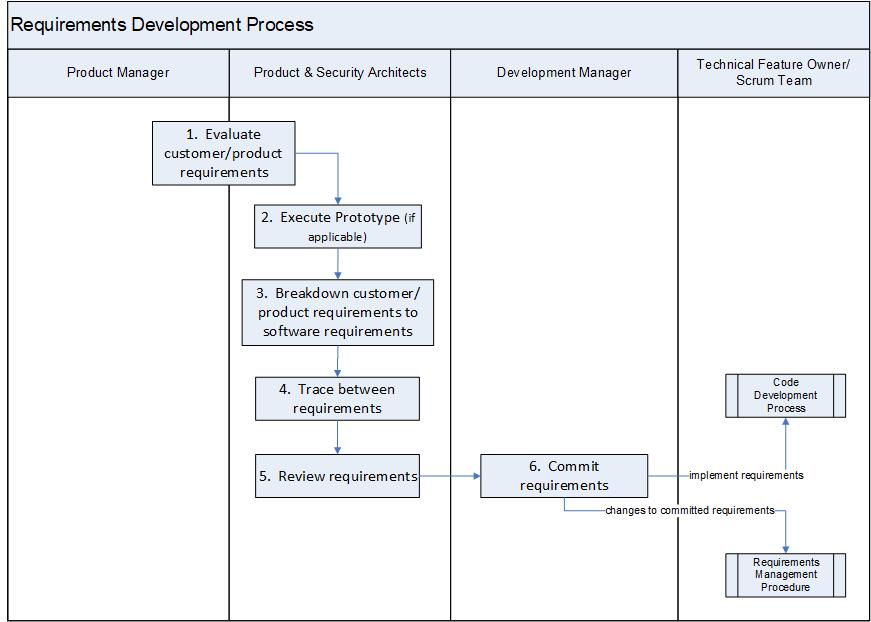

:orphan:

|
|
|

==================================
Requirements Development Procedure  
==================================

|

The procedure describes the development of feature requirements (software requirements) from customer requirements (i.e., Epics from Market Segments and Product Management).  The Product Architect is responsible for this process.

|

+----------------------------+---------------------------------------------------------------------------+
|**Entry Criteria/Inputs**   | - Customer/Product Requirements have been gathered.                       |
|                            | - Product feature backlog is created in the Requirement Management system |
|                            |   e.g., Jira Agile)                                                       |
+----------------------------+---------------------------------------------------------------------------+
|**Exit Criteria/Outputs**   | - Feature requirements (features/epics) are identified and reviewed       |
|                            |   (prioritized)in the Requirement Management System (e.g., Jira Agile)    |
|                            | - Product Architect investigates and captures implementation decisions    |
|                            |   (if applicable)                                                         |
|                            | - Feature requirements are ready for development and committed            |
|                            |   for the release                                                         |
|                            | - Snapshot of the feature/epic requirements as part of the Plan Of        |
|                            |   Record (POR) or Plan of Intent (POI) Milestone                          |
+----------------------------+---------------------------------------------------------------------------+

|

**Stakeholders** 
-----------------	
+------------------------+-------------------------------------------------------------------------------+
| **Role**               | **Responsibilities**                                                          |
+------------------------+-------------------------------------------------------------------------------+
|Product Architect       | Responsible for:                                                              |
|                        |                                                                               |
|                        | - identifying security related requirements                                   |
|                        | - refining requirements description                                           |
|                        | - performing technical analysis                                               |
|                        | - identifying dependencies                                                    |
|                        | - providing preliminary estimate                                              |
|                        | - reviewing Description, DoD, and Acceptance criteria to ensure the           |
|                        |   customer requirement is ready for development                               |
|                        | - approving the Epics for implementation                                      |
+------------------------+-------------------------------------------------------------------------------+
|Development Manager     | Responsible for:                                                              |
|                        |                                                                               |
|                        | - staffing the features/epics                                                 |
|                        | - communicating firm feature/epic commitments into the upcoming release       |
|                        | - communcation intended feature/epic into future releases                     |
+------------------------+-------------------------------------------------------------------------------+
|Scrum Team              | Scrum team includes Technical Feature Owner, Scrum Master, Development        |
|                        | Engineer, Test Engineer, and Information Development Engineer.                |
|                        |                                                                               |
|                        | Responsible for:                                                              |
|                        |                                                                               |
|                        | - further breaking down features/epics into stories                           |
|                        | - developing and testing epics/stories                                        |
|                        | - reviewing the epics/stories to ensure the Definition of Done and Acceptance |
|                        |   criteria are met                                                            |
+------------------------+-------------------------------------------------------------------------------+

|

**Activities**
--------------

|image0|

.. list-table::
   :widths: 10 30 120
   :header-rows: 1

   * - Step #
     - Activity Name
     - Description

   * - 1
     - Evaluate feature requirements  
     - The Product Manager ensures that the product requirements fulfill the `Standard Criteria <./ProductRequirementStandardCriteria.html>`__.   
	 
       The Product Architect evaluates feature requirements from Product Management.  The evaluation is performed collaboratively with Product Manager to ensure a mutual understanding of the customer/product requirements.  This may result in further breakdown of epics into sub-epics to deal with larger scope items.  

   * - 2
     - Execute Prototype (if applicable)
     - The Product Architect may require a prototype be developed to explore possible implementations of the customer requirements.
 	 
   * - 3
     - Breakdown feature requirements  
     - The Product Architect reviews and refines the feature requirements and also identifies the security related requirements. Security related requirements are marked as SDL_REQUIREMENT in the requirement.  **<<Check with Roger>>**
 
       The feature requirements (including security related requirements) are broken down into smaller requirements in the Requirements Management System as Stories including development, testing and documentation Stories. See `Story Process <../../Operations/ProgramManagement/StoryProcess.html>`__.   

       Note: The breakdown of feature requirements also occur iteratively throughout the development lifecycle of the feature/epic.  This activity may also occur as part of a Scrum Team's regular grooming activities.
   
   * - 4 
     - Trace between requirements
     - The Product Architect or Scrum Team maintains a traceability between feature/epic and customer requirements.  Feature requirements are captured as Stories and/or stated broadly in the epic's description.

       The Product Architects are responsible to see that traceability between customer requirements and feature requirements, and the hierarchy of requirements is maintained. 

   * - 5
     - Review requirements
     - The Product Architect reviews and approves the "set of requirements" for implementation. See *Tools and Template Instructions* Section below.
       The feature requirements are reviewed/approved for implementation:

       - to assure features/epics and stories are well formed    
       - to assure traceability between software and customer requirements
       - to assure dependencies with other stakeholders have been identified
       - to assure a preliminary estimate (i.e. costing) has been communicated to Key Stakeholders

       Any outputs deemed incomplete are sent back for refinement. 

   * - 6 
     - Commit requirements
     - After review of the requirements, the Development Manager agrees that the epic is ready for development.  The Development Manager identifies Scrum Teams that own the commitment and ensures an adequate staffing plan is available to deliver on the commitment.  The commitment is made in collaboration with the identified Scrum Team and the Technical Feature Owner.  See *Tools and Template Instructions* Section below.
	   
       The "set of requirements" (features/epics) is committed for the release it will be completed in.  Any changes (e.g., scope, schedule) to the committed Epics will be managed according to `Requirements Management Procedure <./RequirementsManagementProcedure.html>`__ 
	   
       The Scrum team further breaks down the epics into stories.  The Technical Feature Owner/Scrum Team follows the `Code Development Process <../CodingIntBuild/CodeDevelopmentProcess.html>`__. 
	   
       A snapshot of the committed "set of requirements" (features/epics) requirements (from the Requirements Management System) is created at the start of the release as part of the Plan Of Record (POR) or Plan of Intent (POI) milestone and attached to the Release Documentation Repository (e.g., Jive)

|
  
**Tool & Template Instructions**
----------------------------------

**Jira - Epic Record Template:**

The following sections are required from PLM in order to be assessed by the Architect:

- Epic Name
- Epic Summary
- Description
- Acceptance Criteria
- Definition of Done
- PA Owner

The following sections are reviewed by the Architect in step #5:

- Description
- Acceptance Criteria
- Definition of Done
- Preliminary Estimate
- PA Tracking
- Requested Version
- Dependencies

The following sections are reviewed by the Engineering Development Manager in step #6:

- Scrum Team
- Technical Feature Owner
- Committed Version

|

**Related Process Assets/Tools**
---------------------------------

- `Requirements Process Summary Flow Diagram <../../../_static/CoreDev/Requirements/Requirements.jpg>`__
- `Requirements Gathering Process <./RequirementsGatheringProcess.html>`__
- `Enhancement Requests Management process <./EnhancementRequestManagementProcedure.html>`__
- `Requirements Management procedure <./RequirementsManagementProcedure.html>`__
- `Standard Criteria for Product Requirements <./ProductRequirementStandardCriteria.html>`__
- Requirements Management system (e.g., Jira Agile)
- Program Release Management system (e.g., Panorama)
- Defect Management system (e.g., Jira)
   
|

**References**
-----------------

- Refer to `Supplementary Guidelines <../../../SupplementaryGuidelines/SupplementaryGuidelinesIndex.html#requirements>`_ 

|

**Change Log**
--------------

+--------------+-------------------------+---------------+-------------------------+-----------------------------------------------------------------------------------------------------+
| **Date**     | **Change Request ID**   | **Version**   | **Change By**           | **Description**                                                                                     |
+--------------+-------------------------+---------------+-------------------------+-----------------------------------------------------------------------------------------------------+
| 04/29/2020   | N/A                     | 0.1           | Shree Vidya Jayaraman   | Initial Draft                                                                                       |
+--------------+-------------------------+---------------+-------------------------+-----------------------------------------------------------------------------------------------------+
| 05/28/2020   |  N/A                    | 0.2           | Shree Vidya Jayaraman   | Incorporated feedback from Martin and Kitty                                                         | 
+--------------+-------------------------+---------------+-------------------------+-----------------------------------------------------------------------------------------------------+
| 06/11/2020   |  N/A                    | 0.3           | Shree Vidya Jayaraman   | Incorporated feedback from Martin                                                                   | 
+--------------+-------------------------+---------------+-------------------------+-----------------------------------------------------------------------------------------------------+
| 07/13/2020   |  N/A                    | 0.4           | Shree Vidya Jayaraman   | Incorporated feedback from working session with Martin, Kitty, Guillaume and Numan                  | 
+--------------+-------------------------+---------------+-------------------------+-----------------------------------------------------------------------------------------------------+
| 07/24/2020   |  N/A                    | 0.5           | Shree Vidya Jayaraman   | Incorporated feedback from Martin, Kitty and Guillaume                                              | 
+--------------+-------------------------+---------------+-------------------------+-----------------------------------------------------------------------------------------------------+
| 08/24/2020   |  N/A                    | 0.6           | Shree Vidya Jayaraman   | Incorporated feedback based on Kitty's comments                                                     | 
+--------------+-------------------------+---------------+-------------------------+-----------------------------------------------------------------------------------------------------+
|              |                         |               |                         |                                                                                                     | 
+--------------+-------------------------+---------------+-------------------------+-----------------------------------------------------------------------------------------------------+
|              |                         |               |                         |                                                                                                     | 
+--------------+-------------------------+---------------+-------------------------+-----------------------------------------------------------------------------------------------------+
|              |                         |               |                         |                                                                                                     | 
+--------------+-------------------------+---------------+-------------------------+-----------------------------------------------------------------------------------------------------+
|              |                         |               |                         |                                                                                                     | 
+--------------+-------------------------+---------------+-------------------------+-----------------------------------------------------------------------------------------------------+

