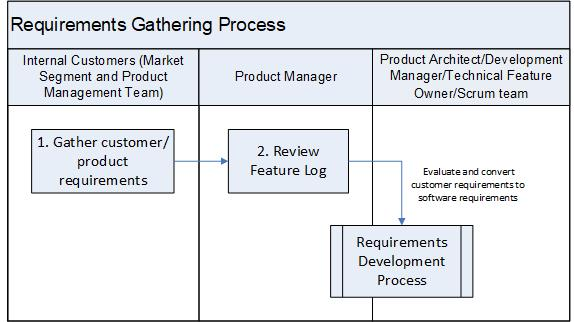

:orphan:

|
|
|

================================
Requirements Gathering Process 
================================

|

The process describes a sequence of activities performed to gather customer requirements.

The Product Manager is responsible for this process.

|

+----------------------------+---------------------------------------------------------------------------+
|**Entry Criteria/Inputs**   | - Customer/Product Requirements from the market segments                  |
+----------------------------+---------------------------------------------------------------------------+
|**Exit Criteria/Outputs**   | - Customer/Product Requirements from the market segments are              |
|                            |   entered into the Requirements Backlog (e.g., Aha)                       |
|                            | - Product feature backlog is created by the Product Manager or            |
|                            |   Engineering team the Engineering Requirement System (e.g., Jira Agile)  |
+----------------------------+---------------------------------------------------------------------------+

|

**Stakeholders**
-----------------	

+------------------------+-------------------------------------------------------------------------------+
| **Role**               | **Responsibilities**                                                          |
+------------------------+-------------------------------------------------------------------------------+
| Internal Customers     | Includes Market Segment team  Field Engineers, Customer Service               |
|                        | Organization (CSO), and Product Management team                               |
|                        |                                                                               |
|                        | Market Segment team is responsible for the Requirements Backlog               |
|                        | (e.g., Salesforce)                                                            |
|                        |                                                                               |
|                        | Product Management team is responsible for the Product Feature Backlog        |
|                        | (e.g., Jira Agile)                                                            |
+------------------------+-------------------------------------------------------------------------------+
| Product Manager        | Responsible for:                                                              |
|                        |                                                                               |
|                        | - entering and managing the Features/Epics in the product/feature backlog     |
|                        | - reviewing and prioritizing the list of features in the backlog              |
|                        | - promoting the top priority features for technical analysis/investigation    |
|                        | - entering the desired release targeted for the feature                       |
+------------------------+-------------------------------------------------------------------------------+

|

**Activities**
--------------

|image0|

.. list-table::
   :widths: 10 30 120
   :header-rows: 1

   * - Step #
     - Activity Name
     - Description

   * - 1
     - Gather customer/product requirements  
     - The marketing team documents the customer requirements into the requirements backlog (e.g., Aha) and the Product Management Team enters one or more features/epics for each product requirement in the Requirement Management System (e.g., Jira Agile) according to the `Feature/Epic Template Guideline - Jira Agile <../../../ProcessDocuments/CoreDev/Requirements/FeatureTemplateGuideline_JiraAgile.docx>`__.  This is called the product feature (epic) backlog.  

   * - 2
     - Review feature backlog
     - The Product Manager/Owner reviews the feature backlog and other Enhancement Requests (ERs).  ERs entered in the Defect Management System (e.g., Jira) are evaluated by the Key Stakeholders (e.g., Product Manager, Customer Support, Engineering Manager, Technical Feature Owner) as possible requirements.  ERs are entered according to the `Enhancement Requests Management process <./EnhancementRequestManagementProcedure.html>`__

       The Product Manager/Owner prioritizes each feature/epic against all other features/epics in the feature backlog and enters the desired release targeted for the feature/pic.  
       The Product Owner promotes the top priority list of features/epics for technical analysis/investigation.
	 	 
   * - 3
     - Evaluate feature requirements  (software requirements)
     - The Product Architect in collaboration with the Scrum Team reviews and refines the feature requirements and identifies the security related requirements according to the `Requirements Development procedure <./RequirementsDevelopmentProcedure.html>`__.   The evaluation is performed collaboratively with Product Manager to ensure alignment.  

|

**Related Process Assets/Tools**
--------------------------------

- `Requirements Process Summary Flow Diagram <../../../_static/CoreDev/Requirements/Requirements.jpg>`__
- `Enhancement Requests Management Procedure <./EnhancementRequestManagementProcedure.html>`__
- `Requirements Development Procedure <RequirementsDevelopmentProcedure.html>`__
- Requirements Backlog (e.g., Aha)
- Requirements Management system (e.g., Jira Agile)
- Defect Management system (e.g., Jira)
   
|

**References**
-----------------

- Refer to `Supplementary Guidelines <../../../SupplementaryGuidelines/SupplementaryGuidelinesIndex.html#requirements>`_ 

|

**Change Log**
--------------

+--------------+-------------------------+---------------+-------------------------+-----------------------------------------------------------------------------------------------------+
| **Date**     | **Change Request ID**   | **Version**   | **Change By**           | **Description**                                                                                     |
+--------------+-------------------------+---------------+-------------------------+-----------------------------------------------------------------------------------------------------+
| 05/26/2020   | N/A                     | 0.1           | Shree Vidya Jayaraman   | Initial Draft                                                                                       |
+--------------+-------------------------+---------------+-------------------------+-----------------------------------------------------------------------------------------------------+
| 07/24/2020   | N/A                     | 0.2           | Shree Vidya Jayaraman   | Update based on Martin, Kitty and Guillaume's feedback                                              |
+--------------+-------------------------+---------------+-------------------------+-----------------------------------------------------------------------------------------------------+
| 08/24/2020   | N/A                     | 0.3           | Shree Vidya Jayaraman   | Updates based on Kitty's feedback                                                                   |
+--------------+-------------------------+---------------+-------------------------+-----------------------------------------------------------------------------------------------------+
|              |                         |               |                         |                                                                                                     |
+--------------+-------------------------+---------------+-------------------------+-----------------------------------------------------------------------------------------------------+
|              |                         |               |                         |                                                                                                     |
+--------------+-------------------------+---------------+-------------------------+-----------------------------------------------------------------------------------------------------+

