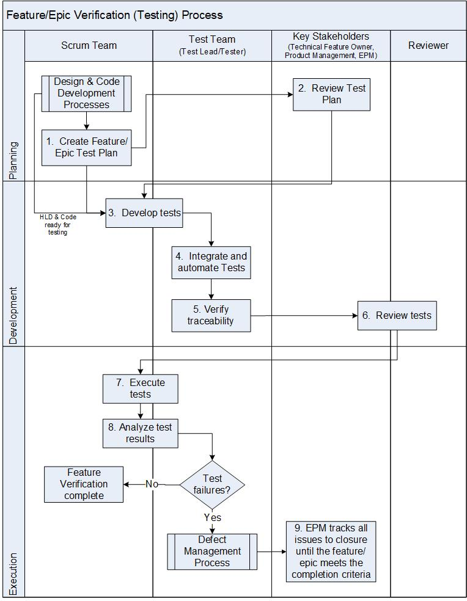

:orphan:
|
|
|

===============================================
Feature/Epic Verification (Testing) Process
===============================================

|

The goal of this process is to confirm that the software meets the defined software requirements and is achieved through the execution of tests. This process ensures that verification tests are conducted to verify the requirements and that the integrated system complies with the software requirements.  

The Technical Feature Owner is responsible for this process.

+--------------------------------------+--------------------------------------------------------------------------+
| **Entry Criteria**                   | - Epic is available and ready for development                            |
|                                      | - Software design documents (HLDs), as needed, have been created         |
+--------------------------------------+--------------------------------------------------------------------------+
| **Inputs**                           | - Epics and/or Stories                                                   |
|                                      | - Design documents or PoC, as needed                                     |
|                                      | - Developed code ready for testing                                       |
+--------------------------------------+--------------------------------------------------------------------------+
| **Exit Criteria**                    | - Execution of tests                                                     |
|                                      | - Review and analysis of test results                                    |
|                                      | - New feature test plans executed and verification completed             |
+--------------------------------------+--------------------------------------------------------------------------+
| **Outputs**                          | - Feature Test Plan                                                      |
|                                      | - Test code                                                              |
|                                      | - Test metadata for automation                                           |
|                                      | - Test results (test logs and test status in the Test Management system) |
|                                      | - Defect records in the Defect Management system                         |
+--------------------------------------+--------------------------------------------------------------------------+

|

**Activities**
--------------

|image0|

.. list-table::
   :widths: 10 30 120
   :header-rows: 1   
   
   * - Step #
     - Activity Name
     - Description
    
   * - 1
     - Create Feature/Epic Test Plan
     - Develop a plan for verifying the integrated software taking into consideration the categorization (e.g., software, component, function and design) of the software requirements and the requirements of any standard(s), if applicable.
  
       For each new feature/epic, a Feature/Epic Test Plan is created using the `Feature/Epic Test Plan template <../../../ProcessDocuments/CoreDev/Verification/FeatureTestPlanTemplate.docx>`__

       The test plan outlines a combination of both functional and integration tests required for the feature/epic.  The plan must correlate with design documents and testable elements of the feature/epic's acceptance criteria.  
	   
   * - 2
     - Review Test Plan
     - The test plan is reviewed by the Techical Feature Owner, Product Management, Scrum Team, EPM and other relevant stake holders using the Peer Review system (eg., Code Collaborator), as defined by the `Document Review process <../../Operations/ConfigurationManagement/DocumentReviewProcedure.html>`__ and placed under Configuration Management system. 	      
    	
       In complex situations the feature/epic test plan may call for system level test cases to be created.  These should be identified and brought to the attention of the Test Lead.
	   
   * - 3
     - Develop Tests
     - The goal of the test specification development is to demonstrate compliance of the software to the requirements through verification tests.
  
       Design tests to verify the requirement by:
	 
       -  Reviewing and analyzing the requirements so that the requirements are clear enough for further verification
	 
       -  Create appropriate test methods and/or test codes for the verification of requirements
	 
       In instances where features/epics extend pre-existing functionality, functional test cases that have been automated as part of the regression test suite may need to be modified.
    
   * - 4
     - Integrate and automate tests
     - Following (or during) feature/epic development, Scrum Teams may pass-on test code to the Test Team for integration and automation into the regression test suite (which typically runs nightly).

       The Test Team ensures correct metadata and traceability is established when test cases are integration into the regression suite.  Test case execution may also be extended to different configurations and hardware platforms. In some situations, the integration and automation of tests may be done by the Scrum Team directly.
	 
   * - 5
     - Verify Traceability
     - The Feature/Epic Test Plan is directly traceable to the specific Feature/Epic in the Requirements Management system.  Using the Test Management system, consistency and bidirectional traceability are established between software requirements, and verification test cases and logs.
	 
   * - 6
     - Review Tests
     - Verification tests are reviewed and the reviewer examines the test code for defects. 
  
       In case of any findings, the Author and Reviewer mutually agree on the action.  The findings are resolved by repeating the above steps.  
  
       In the case that agreement cannot be reached, the issue is escalated to the PA Owner.

   * - 7
     - Execute Tests
     - Verify the software using test cases that the software fulfilled its intended use. Verification/Test is performed according to the test cases. 
  
       Document the test results.  Software Test results include the test logs and test status.
	   
       Test results are uploaded to the Test Management System and associated to the Epic and Stories under development.

   * - 8
     - Analyze Test Results
     - Analyze the verification test results.
  
       For test failures, determine if the failures are due to test code or product defect. Take steps to resolve the failure by either fixing the test code or filing a defect against the product. Defects are evaluated, resolved, or published as specified by the `Defect Management Process <../../Operations/DefectManagement/DefectManagementProcess.html>`__.

   * - 9
     - Track All Issues to Closure
     - Outstanding issues are entered into the Defect Management System and tracked at the program level by EPM until the feature/epic meets required Feature/Epic Completion criteria.
	 
|

**Related Process Assets/Tools**
--------------------------------

- `Verification Validation Summary Flow Diagram <../../../_static/CoreDev/Verification/VerificationValidation.jpg>`__
- Test Management system (e.g., LTAF) 
- Requirements Management system (e.g., Jira Agile)
- Defect Management system (e.g., Jira)
- `Test Process Guideline <./TestProcessGuideline.html>`__
- `Feature Test Plan template <../../../ProcessDocuments/CoreDev/Verification/FeatureTestPlanTemplate.docx>`__
- `Release Test Strategy template <../../../ProcessDocuments/CoreDev/Verification/ReleaseTestStrategyTemplate.docx>`__
   
|

**References**
-----------------

- `working guide <https://jive.windriver.com/docs/DOC-80308>`__
- `VxWorks Test Case Meta Data File (test_case.conf) Usage Guideline (recovered version) <https://jive.windriver.com/docs/DOC-80297>`__
- `Uploading Manual test Results to LTAF <../../../WorkInstructions/Test/UploadingFeatureTestResults_WI.html>`_ 
- `VxWorks 7 Regression Test Suite User Guide_SR3630 <./vxworks_7_regression_test_suite_users_guide_sr0630.pdf>`_ (*NL 8/12:  I don't see this file anywhere?*)

|

**Change Log**
--------------

+--------------+-------------------------+---------------+-------------------------+-----------------------------------------------------------------------------------------------------+
| **Date**     | **Change Request ID**   | **Version**   | **Change By**           | **Description**                                                                                     |
+--------------+-------------------------+---------------+-------------------------+-----------------------------------------------------------------------------------------------------+
| 05/19/2020   | N/A                     | 0.1           | Shree Vidya Jayaraman   | Initial Draft                                                                                       |
+--------------+-------------------------+---------------+-------------------------+-----------------------------------------------------------------------------------------------------+
| 06/29/2020   | N/A                     | 0.2           | Shree Vidya Jayaraman   | Updates based on Martin's feedback                                                                  |
+--------------+-------------------------+---------------+-------------------------+-----------------------------------------------------------------------------------------------------+
| 08/04/2020   | N/A                     | 0.3           | Shree Vidya Jayaraman   | Updates based on Kitty's feedback                                                                   |
+--------------+-------------------------+---------------+-------------------------+-----------------------------------------------------------------------------------------------------+
| 08/05/2020   | N/A                     | 0.4           | Shree Vidya Jayaraman   | Updates to the Exit Criteria and Diagram based on Kitty's feedback                                  |
+--------------+-------------------------+---------------+-------------------------+-----------------------------------------------------------------------------------------------------+
|              |                         |               |                         |                                                                                                     |
+--------------+-------------------------+---------------+-------------------------+-----------------------------------------------------------------------------------------------------+
|              |                         |               |                         |                                                                                                     |
+--------------+-------------------------+---------------+-------------------------+-----------------------------------------------------------------------------------------------------+

