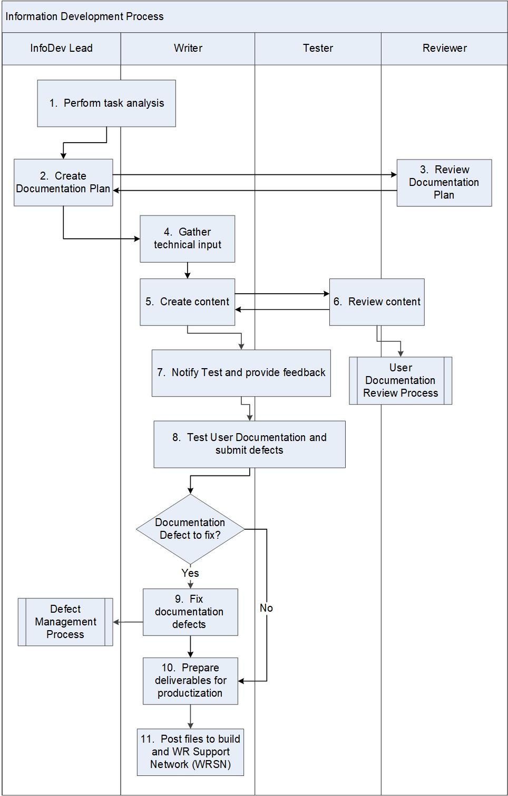

:orphan:
|
|
|

======================================
Information Development Process 
======================================

|

The Information Development (InfoDev) group is responsible for writing the product technical publications and documentation for their customers. The user documentation content and delivery are described in the Documentation Plan.

This process describes the activities for writing, testing, and publishing user documentation for the product release. An InfoDev Lead is assigned to each product release and is responsible for executing this process.

|

+--------------------------------------+--------------------------------------+
| **Entry Criteria**                   | Release or Sprint Planning begins.   |
+--------------------------------------+--------------------------------------+
| **Inputs**                           | -  Documentation plans from similar  |
|                                      |    past products                     |
|                                      | -  Standard InfoDev Guidelines on    |
|                                      |    what user documentation should    |
|                                      |    contain                           |
|                                      | -  List of customer requirements     |
|                                      |    (i.e., Epics from marketing and   |
|                                      |    community)                        |
|                                      |    Development wants to commit to    |
|                                      | -  Estimates of complexity and size  |
|                                      |    of features                       |
|                                      | -  Assessment of reuse vs. rewrite   |
|                                      |    of documentation                  |
|                                      | -  Customer requests (e.g.,          |
|                                      |    Defect or Enhancement Request in  |
|                                      |    Defect Management System) for user|
|                                      |    documentation enhancements or     |
|                                      |    improvements                      |
+--------------------------------------+--------------------------------------+
| **Exit Criteria**                    | -  User Documentation reviewed,      |
|                                      |    tested and approved for the       |
|                                      |    product release per Documentation |
|                                      |    and Test Plans                    |
|                                      | -  Required files checked-in for     |
|                                      |    media as per the requirements or  |
|                                      |    documentation plan                |
|                                      | -  Required files posted to the web  |
|                                      |    for Wind River Support Network    |
|                                      |    (WRSN)                            |
+--------------------------------------+--------------------------------------+
| **Outputs**                          | -  Documentation Plan                |
|                                      | -  Documentation Test Cases and      |
|                                      |    Results                           |
|                                      | -  User Documentation                |
|                                      | -  Files posted for WRSN             |
+--------------------------------------+--------------------------------------+

|

**Activities**
--------------

|image0|

.. list-table::
   :widths: 10 30 120
   :header-rows: 1   
   
   * - Step #
     - Activity Name
     - Description
    
   * - 1
     - Perform task analysis
     - Analyze the tasks based on the committed requirements with Development and identify new and revised user tasks required to support new functionality.
    
   * - 2
     - Create Documentation Plan
     - Write detailed Documentation Plan using the plan template, available at //ala-nas2/docs/templates/docplan. 
    
   * - 3
     - Review Documentation Plan
     - Review the detailed Documentation Plan with the relevant stakeholders.

       Collaboration between:  InfoDev, Development, Field Engineering, Test and Product Management.

   * - 4
     - Gather technical input
     - Writers gather input for their content.  Input comes through: interviews with Developers, design documentation, discussion with Field Engineering, and hands-on experimentation.

       Collaboration between:  Product Management, InfoDev, Development, and Field Engineering.
    
   * - 5
     - Create source content
     - Create source content from engineering sources.

       During development, store the working versions of the source content in InfoDev content management system.  
    
   * - 6
     - Review content
     - Review content for technical accuracy.  See `Information Documentation Review process <./InfoDevReviewProcess.html>`__

       Collaboration between: InfODev, Development, Field Engineering, Product Management, and Customer Service Organization (CSO).
    
   * - 7
     - Notify Test and provide feedback
     - Collaboration between:  Engineering, Test, and InfoDev to create and review documentation test cases.
    
   * - 8
     - Test the User Documentation and submit defects
     - Documents are posted to the WRSN Staging website at https://windriver-staging.zoominsoftware.io/ for test.  InfoDev and Test team collaborate to test the User Documentation using the Documentation Test Cases and submit defects in the defect tracking system.
  
   * - 9
     - Fix Documentation defects
     - InfoDev group resolves the Documentation defects and Development group resolves the product defects by using the `Defect Management Process <../DefectManagement/DefectManagementProcess.html>`__.   
    
   * - 10
     - Prepare deliverables for productization
     - The source files will be used to create output using the InfoDev content management system.

       Check-in the contents to configuration management system (e.g., Git)
    
   * - 11
     - Post files to build and WR Support Network (WRSN)
     - Source files are published in the content management system.

       Files are posted to WRSN.
	   
|

**Tools and Templates**
-----------------------

-  XML/DITA (Documentation Methodology and Standards)
-  iXiasoft (Content Management System)
-  Documentation Plan Template: file:  //ala-nas2.wrs.com/docs/templates/docplan 
-  Jira Agile (Requirement Management System)
-  JIRA (Defect Tracking Tool)
-  Jive (Collaboration Tool)
-  Git (Configuration Management)

|

**Change Log**
--------------

+--------------+-------------------------+---------------+-------------------------+-----------------------------------------------------------------------+
| **Date**     | **Change Request ID**   | **Version**   | **Change By**           | **Description**                                                       |
+--------------+-------------------------+---------------+-------------------------+-----------------------------------------------------------------------+
| 06/12/2020   | N/A                     | 0.1           | Shree Vidya Jayaraman   | Initial Draft                                                         |
+--------------+-------------------------+---------------+-------------------------+-----------------------------------------------------------------------+
|              |                         |               |                         |                                                                       |
+--------------+-------------------------+---------------+-------------------------+-----------------------------------------------------------------------+
 

