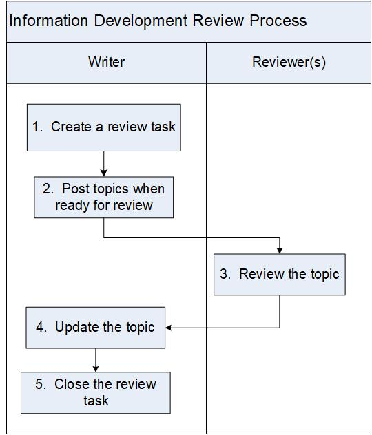

:orphan:
|
|
|

============================================
Information Development Review Process
============================================

|

This process covers technical reviews of the User Documentation. The Information Development (InfoDev) Writer is responsible for initiating and coordinating this process. The required Reviewers are responsible for ensuring the technical accuracy of documentation by reviewing and providing comments.

|

+--------------------------------------+--------------------------------------+
| **Entry Criteria**                   | A documentation topic or topic set   |
|                                      | is ready for review.                 |
+--------------------------------------+--------------------------------------+
| **Inputs**                           | Documentation topic(s).              |
+--------------------------------------+--------------------------------------+
| **Exit Criteria**                    | Technical review of the              |
|                                      | documentation task has been held.    |
|                                      | Comments have been incorporated into |
|                                      | topics as necessary.                 |
+--------------------------------------+--------------------------------------+
| **Outputs**                          | -  One or more reviewed and updated  |
|                                      |    topics                            |
|                                      | -  Documentation review task closed  |
|                                      |    in Requirements Management system,|
|                                      |    (e.g., Jira Agile)                |
+--------------------------------------+--------------------------------------+

|

**Activities**
--------------

|image0|

.. list-table::
   :widths: 10 30 120
   :header-rows: 1   
   
   * - Step #
     - Activity Name
     - Description
    
   * - 1
     - Create a review task in Requirements Management System (e.g., Jira Agile)
     - For each topic to be reviewed, the Writer opens a documentation review task.

       Reviewers are assigned based on the development role in the review task.
    
   * - 2
     - Post topics when ready for review 
     - Documents are continually posted to the `Work in Progress <http://internal.wrs.com/engineering/engops/techpubs/docDrafts/index.php>`__ website:

       Put a link to the topic to be reviewed or on the Work in Progress website, or attach the topic in the review task. The material may be updated during the review and re-posted or attached. 
    
   * - 3
     - Review the topic
     - Reviewers provide feedback to writers based on topic. This can be an iterative process of questions and discussions and possibly intermediate versions of the topic being created.

   * - 4
     - Update the topic
     - The Writer revises the document, if necessary.

   * - 5
     - Close the review task
     - The Writer closes the documentation review task when:
	 
       -  the technical review has been held
	 
       -  all required Reviewers have completed their reviews
	 
       -  any questions have been resolved
	 
       -  the topic has been updated as necessary
	   
|
	 	 
**Change Log**
--------------

+--------------+-------------------------+---------------+-------------------------+-----------------------------------------------------------------------+
| **Date**     | **Change Request ID**   | **Version**   | **Change By**           | **Description**                                                       |
+--------------+-------------------------+---------------+-------------------------+-----------------------------------------------------------------------+
| 06/12/2020   | N/A                     | 0.1           | Shree Vidya Jayaraman   | Initial Draft                                                         |
+--------------+-------------------------+---------------+-------------------------+-----------------------------------------------------------------------+
|              |                         |               |                         |                                                                       |
+--------------+-------------------------+---------------+-------------------------+-----------------------------------------------------------------------+
 

