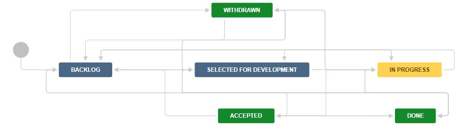
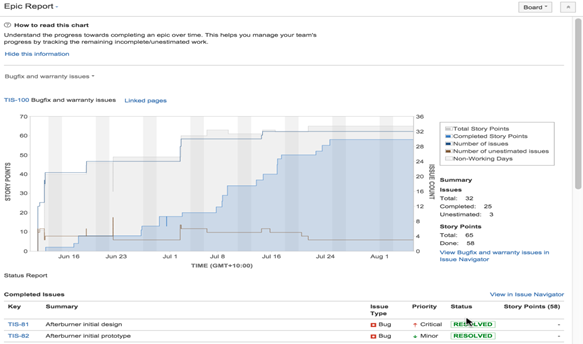
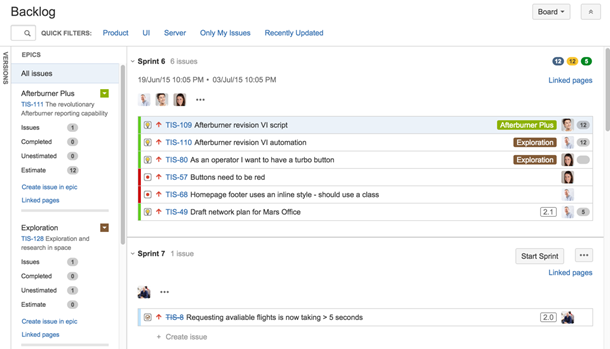

:orphan:
|
|
|

===========================================
Epics in Jira Agile
===========================================

|

**Summary**
------------

An Epic in Jira Agile corresponds to a feature and captures a large body of work. It usually takes more than one sprint to complete and is broken down into a number of Stories.

Epics are planned and managed at the program level, and are in the program project.

This guideline details how to manage and report on Epics using Jira Agile.

|

**Managing Epics**
--------------------

**Creating an Epic**
~~~~~~~~~~~~~~~~~~~~~~

1. Navigate to the program project.
2. On the navigation bar, click **Create**.
3. Select Issue Type = Epic.
4. The following fields must be completed:

   - Epic name – a short identifier for Epic; this will be used as a label on issues that belong to this epic
   - Summary – brief summary of the feature; this will be displayed in the Epic panel
   - Definition of Done
   - Acceptance Criteria

5. Click **Create**

|

**Administering Epics**
~~~~~~~~~~~~~~~~~~~~~~~~

Epics can be administered in the execution project.

- Navigate to the execution project.
- Go to the scrum backlog board.
- Click **Epics** on the left side of the board (aligned vertically) to open the Epics column. This shows all the Epics in the program release.

+--------------------------------------+----------------------------------------------------------------+
|          Activity                    |                            Instructions                        |
+--------------------------------------+----------------------------------------------------------------+
| Update an Epic's details             | - Click the colored arrow on the right, next to the Epic's name|
|                                      | - Choose **View Epic** details                                 |
|                                      | - Edit the Epic like any other issues                          |
+--------------------------------------+----------------------------------------------------------------+
| Change an Epic's color on the board  | - Click the colored arrow on the right, next to the Epic's name|
|                                      | - Choose the color from the menu                               |
+--------------------------------------+----------------------------------------------------------------+
| Add an exisiting Story to an Epic    | - Drag and drop the Story onto the Epic in the 'Epics' column  |
+--------------------------------------+----------------------------------------------------------------+
| Add an new Story to an Epic          | - Refer to `Stories in Jira Agile <StoriesinJiraAgile.html>`__ |
+--------------------------------------+----------------------------------------------------------------+
| Remove a Story from an Epic          | - Drag and drop the Story onto Issues without Epics in the     |
|                                      |   Epics column.                                                |
+--------------------------------------+----------------------------------------------------------------+
| View issues in an Epic               | - Click the epic in the Epics column to show only issues in    |
|                                      |   that Epic. Click All issues to remove the filter.            |
+--------------------------------------+----------------------------------------------------------------+
| Monitor the progress of an Epic      | - Use the Epic Report to track the complete, incomplete and    |
|                                      |   unestimated issues in an Epic. Refer to the Reporting section|
|                                      |   below                                                        |
+--------------------------------------+----------------------------------------------------------------+
| Rank Epics                           | - In the Epics column, drag the Epics up and down to change the| 
|                                      |   ranking                                                      |
+--------------------------------------+----------------------------------------------------------------+


**Ranking Epics using a Kanban board**
~~~~~~~~~~~~~~~~~~~~~~~~~~~~~~~~~~~~~~~

Ranking Epics can be easier in a Kanban board, where Epics can be dragged and dropped to rerank them. To create such a Kanban board:

#. Create a filter that selects only the Epics in the program project, such as **project in (VXWPG) and issuetype = Epic order by Rank asc**.
#. Share the filter with all logged-in users.
#. Go to the `Sample All Epics Ranking <https://jira.wrs.com/secure/RapidView.jspa?rapidView=247&tab=filter>`__ board.
#. Click the **Board** button and choose **Copy**.
#. Change the board name and update the filter to the one created.

The Kanban board can be used to rerank Epics.

|

**Workflow**
-------------

Here is the workflow for Epics.

|image0|

"Issues" in the table below refers to the Stories, Bugs and Support Requests (where applicable) in the Epic.

+-------------------------+---------------------------+-----------------------------------+-----------------------------------+-----------------------------+-----------------------------------+
|        **State**        |      **Meaning**          |        **What happens next**      | **Who should move to this state** |        **Conditions**       |        **Automation**             |
+-------------------------+---------------------------+-----------------------------------+-----------------------------------+-----------------------------+-----------------------------------+
| Backlog                 | Newly entered             | Team reviews Stories              | Any member                        | None                        | None                              |
+-------------------------+---------------------------+-----------------------------------+-----------------------------------+-----------------------------+-----------------------------------+
| Selected for Development| In the path of development| Team is provided with Stories to  | Product Owner                     | None                        | Move to state when any Story moves|
|                         |                           | breakdown the Epic                |                                   |                             | to **Selected for Development**   |
+-------------------------+---------------------------+-----------------------------------+-----------------------------------+-----------------------------+-----------------------------------+
| In Progress             | Being worked on           | Stories are completed             | Any member                        | None                        | Move to state when any Story moves|
|                         |                           |                                   |                                   |                             | to **In Progress**                |
+-------------------------+---------------------------+-----------------------------------+-----------------------------------+-----------------------------+-----------------------------------+
| Done                    | All work completed        | Product Owner evaluates Epic      | Any member                        | Only available if all issues| Move to state when all issues are |
|                         |                           |                                   |                                   | are **Accepted, Closed**,   | **Accepted, Closed, Resolved**,   |
|                         |                           |                                   |                                   | **Resolved or Withdrawn**   | **or Withdrawn**                  |
+-------------------------+---------------------------+-----------------------------------+-----------------------------------+-----------------------------+-----------------------------------+
| Accepted                | Product Owner agrees work | Epic is completed                 | Product Owner                     |  None                       | None                              |
|                         | is complete               |                                   |                                   |                             |                                   |
+-------------------------+---------------------------+-----------------------------------+-----------------------------------+-----------------------------+-----------------------------------+
| Withdrawn               | Product Owner agrees Epic | Epic is no longer considered for  | Product Owner                     |  None                       | None                              |
|                         | is no longer needed       | development                       |                                   |                             |                                   |
+-------------------------+---------------------------+-----------------------------------+-----------------------------------+-----------------------------+-----------------------------------+

|

**Reporting**
-------------

**Epic Report**
~~~~~~~~~~~~~~~~~

The Epic Report shows a list of complete, incomplete, and unestimated issues in an epic. It is particularly useful in planning work for an Epic that may extend over multiple sprints.

Use the Epic Report to understand the progress towards completing an Epic over time, and to track the amount of work that remains incomplete or unestimated.


**Viewing the Epic Report**
````````````````````````````

#. Navigate to the execution project.
#. Go to the Scrum Backlog
#. In the sidebar, select the **Reports** page, which is indicated by a bar chart icon if the sidebar is collapsed.
#. Select **Epic Report**.
#. Select the relevant epic from the **Epic** drop-down.
#. Click **View in Issue Navigator** to jump to the Issue Navigator and see a list of all the Epic's issues.

|image1|

**Understanding the Epic Report**
```````````````````````````````````
The Epic Report’s output is based on the board's column mapping. An issue is considered 'To Do' when it is in a status that has been mapped to the left-most column of the board. An issue is considered 'Done' when it is in a status that has been mapped to the right-most column of the board.


**Epic Burndown**
~~~~~~~~~~~~~~~~~

The Epic Burndown report shows how the team is progressing against the work for an Epic. The report will show data based on the field that the board is using: Story points or hours.

Here are some of the ways that an Epic Burndown report can be used:

- See how quickly the team is working through the Epic.
- See how work added and removed during the sprint has affected the team's overall progress.
- Predict how many sprints it will take to complete the work for an Epic, based on past sprints and changes during the sprints.


**Viewing the Epic Burndown**
```````````````````````````````

#. Navigate to the execution project.
#. Go to the scrum backlog.
#. In the sidebar, select the **Reports** page, which is indicated by a bar chart icon if the sidebar is collapsed.
#. Select **Epic Burndown**.
#. Select the relevant epic from the **Epic** drop-down.

|image2|


**Understanding the Epic Burndown Report**
````````````````````````````````````````````

- Light green section = work completed during the sprint
- Light blue section = work remaining in the epic, out of the total work estimated for the epic at the start of the sprint
- Dark blue section = work that was added during the sprint, but not originally included (i.e., scope change)
- Light green section + light blue section = total work in the epic that was originally estimated at the start of the sprint
- Light blue section + dark blue section = total work in the epic remaining at the end of the sprint
- Bars with grey sections = predicted sprints

|


**Epics and Backlog**
-----------------------

**Viewing an Epic in the Scrum Backlog Board**
~~~~~~~~~~~~~~~~~~~~~~~~~~~~~~~~~~~~~~~~~~~~~~~

This is applicable only in the execution project.

The blue horizontal bar under an epic’s details in the Epics column indicates progress towards completing the work estimated for the issues added to the Epic. This bar only represents progress on the issues in an epic that have estimates.

|image3|


|

**Change Log**
--------------

+----------------+----------------+----------------+----------------+---------------------------------------+
| **Date**       | **Change       | **Version**    | **Change By**  | **Description**                       |
|                | Request ID**   |                |                |                                       |
+----------------+----------------+----------------+----------------+---------------------------------------+
| 07/30/2020     | N/A            | 0.1            | Doina Lepadat  | Initial Draft                         |
+----------------+----------------+----------------+----------------+---------------------------------------+
|                |                |                |                |                                       |
+----------------+----------------+----------------+----------------+---------------------------------------+
|                |                |                |                |                                       |
+----------------+----------------+----------------+----------------+---------------------------------------+




.. |image2| image:: ../../../_static/Operations/ProgramManagement/EpicsInJiraAgile_Image2.jpg 
