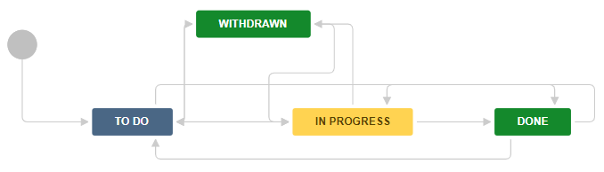

:orphan:
|
|
|

===========================================
Stories in Jira Agile
===========================================

|

**Summary**
------------

A Story in Jira corresponds to a single set of work that takes one sprint to complete. A story is part of an epic, and must be connected to an epic so that stories can be prioritized and executed in order.

Stories are planned and managed at the release level, and are in the execution project.

This guideline details how to manage and report on Stories using Jira Agile.

|

**Managing Stories**
--------------------

**Creating a Story**
~~~~~~~~~~~~~~~~~~~~ 

There are two ways to create a Story in Jira Agile.


**Creating a Story from the navigation bar**
`````````````````````````````````````````````

1. Navigate to the execution project.
2. On the navigation bar, click **Create**.
3. Select Issue Type = Story.
4. The following fields must be completed:

- Summary 
- Epic Link
- Definition of Done
- Acceptance Criteria

5. Click **Create**

**Creating a Story from the Epics column**
`````````````````````````````````````````````
1. Navigate to the execution project.
2. Go to the scrum backlog board.
3. On the left side of the page is the Epics You can show the epics by clicking EPICS.
4. Click the epic in which you want to create the story.
5. Click Create issue in epic. A window will open to create a Story.
6. The following fields must be completed:

- Summary 
- Epic Link
- Definition of Done
- Acceptance Criteria

7. Click **Create**.


A new story is added to the epic.

**Grooming a Story**
~~~~~~~~~~~~~~~~~~~~~~~~

There are several elements that need attention when grooming a story:

#. Review and revise Description, Definition of Done, and Acceptance Criteria as needed.
#. Set the Assignee and the Acceptor, who will move the story to Accepted if completed.
#. Determine whether the story needs sub-tasks or can stand alone.

   - If sub-tasks are needed, create sub-tasks with Assignee and Original Estimate.
   - If sub-tasks are not needed, set the Original Estimate in the story.

**Assigning a Story to a Sprint**
~~~~~~~~~~~~~~~~~~~~~~~~~~~~~~~~~~~
Refer to `Sprints in Jira Agile <./SprintsInJiraAgile.html>`__ for details about how to manage Stories and Sprints.


**Ranking Stories outside the Scrum Backlog Board**
~~~~~~~~~~~~~~~~~~~~~~~~~~~~~~~~~~~~~~~~~~~~~~~~~~~~~

In the Backlog section of the scrum backlog board, click the  icon. This will open a new tab with the backlog filter results.

The issues in the filter can then be dragged and dropped to change rank.

**Reporting**
~~~~~~~~~~~~~~~ 
Reporting on stories is done in the context of a sprint. Refer to `Sprints in Jira Agile <./SprintsInJiraAgile.html>`__ for details about reporting.

|

**Recording Work**
--------------------

When a story is being groomed, the scrum team should decide whether the story needs to be broken down into sub-tasks or can be accomplished as a single piece of work.

If the story is broken down into sub-tasks, work must be logged in the sub-tasks and not in the story. If the story has no sub-tasks, work must be logged in the story itself.

**Sub-Tasks**
~~~~~~~~~~~~~~ 

**Creating a Sub-Task**
```````````````````````` 

#. Select a Story.
#. Click **More -> Create Sub-task**.
#. Select Issue Type = Sub-task.
#. Fill in the summary.
#. Click **Create**.

**Moving a Sub-task to Another Story**
```````````````````````````````````````` 
#. Select a Story.
#. Click the Sub-task. 
#. Click **More -> Move**.
#. Select **Change Parent**.
#. Enter the ID of the new parent.
#. Click **Change Parent**.

Note that work is recorded either in the story or in the Sub-tasks, but not in both.

**Logging Work**
~~~~~~~~~~~~~~~~~ 

**Estimate time on a Story or Sub-Task**
`````````````````````````````````````````````
#. Select the story or Sub-task.
#. Click **Edit**.
#. Enter the amount of time you believe it will take to complete work on the issue in the **Original Estimate** field on the **Overview**.
#. Click **Update**.
	
**Log time on a Story or Sub-Task**
`````````````````````````````````````````````
#. Select the Story or Sub-task.
#. Click either the **+** in the Time Tracking section of the page or **More -> Log Work**.
#. Fill in the Log time fields and adjust the **Remaining Estimate** as needed.
#. Click **Save**

Note the total time spent in the Time Tracking section of the story. If using Sub-tasks, check the **Include sub-tasks** box.

|
 
**Workflows**
-------------- 

**Story**
~~~~~~~~~~~

|image0|

The workflow of the Story depends on the **Original Estimate** or Sub-Tasks being created and updated to reflect the work being done. Setting **Original Estimate** also sets **Remaining Estimate**. Logging work reduces **Remaining Estimate**. In the Log Work screen, **Remaining Estimate** can also be set manually.

+-------------------------+---------------------------+-----------------------------------+-----------------------------+-----------------------------------+
|        **State**        |      **Meaning**          | **Who should move to this state** |        **Conditions**       |        **Automation**             |
+-------------------------+---------------------------+-----------------------------------+-----------------------------+-----------------------------------+ 
| Accepted                | Acceptor agrees work is   | Product Owner                     |  None                       | None                              |
|                         | complete                  |                                   |                             |                                   |
+-------------------------+---------------------------+-----------------------------------+-----------------------------+-----------------------------------+ 
| Done                    | All work completed        | Any member                        | Only available if:          | Move to state when:               |
|                         |                           |                                   | ** Remaining Estimate** = 0 | ** Remaining Estimate** = 0       |
|                         |                           |                                   | or                          | or                                |
|                         |                           |                                   | All Sub-Tasks are **Done**  | All Sub-Tasks are **Done**        |
+-------------------------+---------------------------+-----------------------------------+-----------------------------+-----------------------------------+ 
| In Progress             | Being worked in a Sprint  | Any member                        | Only available if:          | Move to state when any Sub-Task   |
|                         |                           |                                   | ** Remaining Estimate** > 0 | moves to **In Progress**          |
|                         |                           |                                   | or                          |                                   |
|                         |                           |                                   | At least one Sub-Task moves |                                   |
|                         |                           |                                   | to **In Progress** or       |                                   |
|                         |                           |                                   | **Done**                    |                                   |
+-------------------------+---------------------------+-----------------------------------+-----------------------------+-----------------------------------+ 
| Backlog                 | Newly entered             | Any member                        | None                        | None                              |
+-------------------------+---------------------------+-----------------------------------+-----------------------------+-----------------------------------+ 
| Withdrawn               | Product Owner agrees Epic | Reporter                          | None                        | None                              |
|                         | is no longer needed       |                                   |                             |                                   |
+-------------------------+---------------------------+-----------------------------------+-----------------------------+-----------------------------------+ 
| Selected for Development| Ready to be scheduled in a| Team, as part of planning         | None                        | None                              |
|                         | Sprint                    |                                   |                             |                                   |
+-------------------------+---------------------------+-----------------------------------+-----------------------------+-----------------------------------+ 


**Sub-Task**
~~~~~~~~~~~~~~ 
 
|image1|

+-------------------------+---------------------------+-----------------------------+-----------------------------------+
|        **State**        |      **Meaning**          |        **Conditions**       |        **Automation**             |
+-------------------------+---------------------------+-----------------------------+-----------------------------------+
| To Do                   | Work has not begun        | None                        | None                              |
+-------------------------+---------------------------+-----------------------------+-----------------------------------+
| To Do                   | Work has begun            | Only available if           | None                              |
|                         |                           | **Remaining Estimate** > 0  |                                   |
+-------------------------+---------------------------+-----------------------------+-----------------------------------+
| To Do                   | All work completed        | Only available if           | Move to state when                |
|                         |                           | **Remaining Estimate** > 0  | **Remaining Estimate** = 0        |
+-------------------------+---------------------------+-----------------------------+-----------------------------------+

|

**Change Log**
--------------

+----------------+----------------+----------------+----------------+---------------------------------------+
| **Date**       | **Change       | **Version**    | **Change By**  | **Description**                       |
|                | Request ID**   |                |                |                                       |
+----------------+----------------+----------------+----------------+---------------------------------------+
| 07/30/2020     | N/A            | 0.1            | Doina Lepadat  | Initial Draft                         |
+----------------+----------------+----------------+----------------+---------------------------------------+
|                |                |                |                |                                       |
+----------------+----------------+----------------+----------------+---------------------------------------+
|                |                |                |                |                                       |
+----------------+----------------+----------------+----------------+---------------------------------------+


.. |image0| image:: ../../../_static/Operations/ProgramManagement/StoriesInJiraAgile_Image0.jpg 

